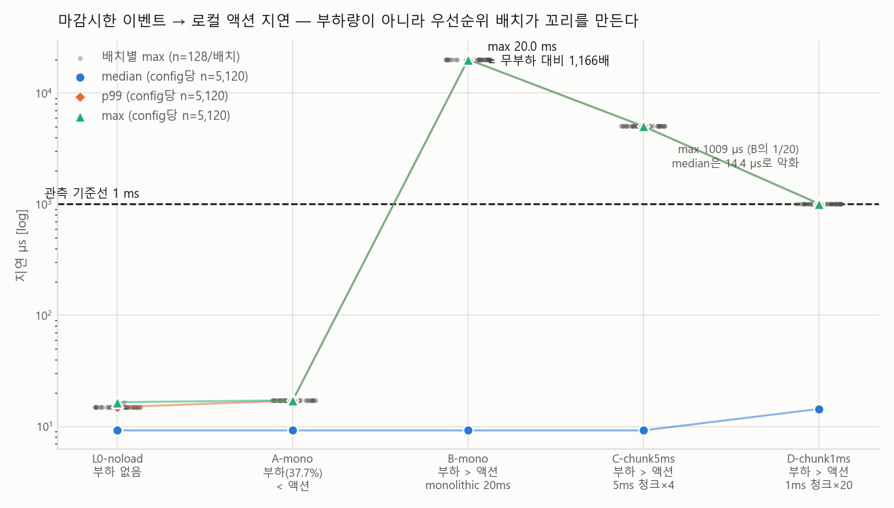
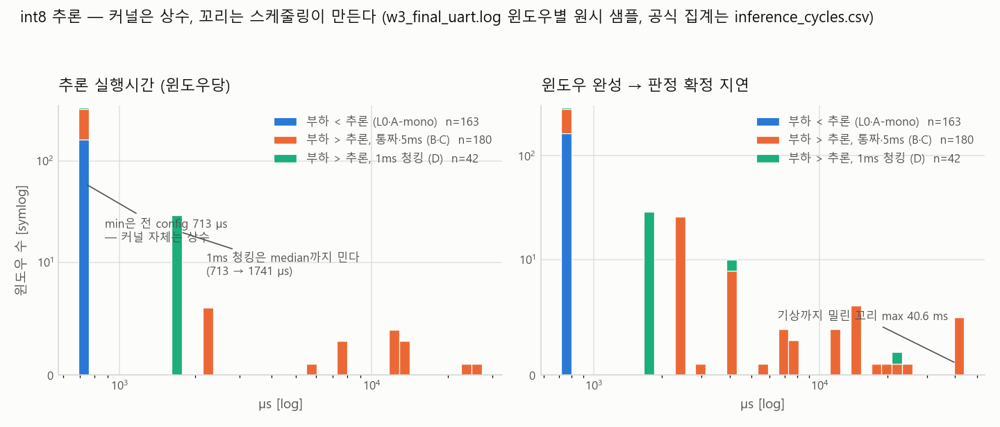
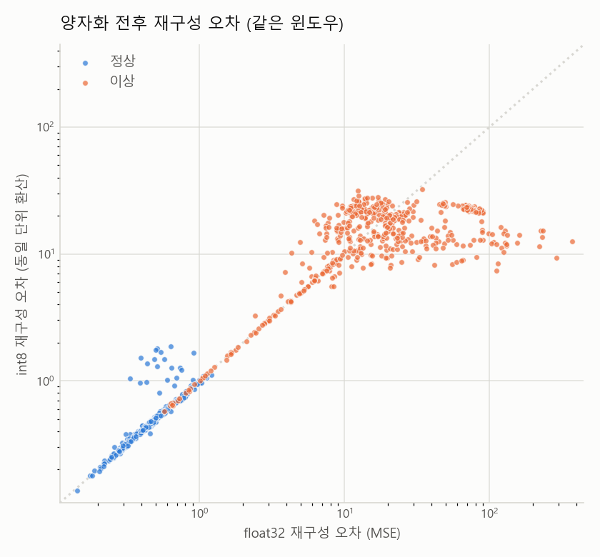

# ondevice-ai — 온디바이스 실시간 엣지 AI 노드

STM32(Nucleo-F411RE) + MPU6050 하나로 **"센서 → 로컬 int8 추론 → 로컬 액션"** 엣지 노드의
슬라이스를 만들고, 그 위에서 두 가지 질문에 **측정으로** 답한 프로젝트.

- **축 A — 실시간 결정성**: 추론 같은 무거운 태스크가 하드 마감시한 태스크와 공존할 때,
  무엇이 마감시한을 좌우하는가? (답: 부하량이 아니라 **우선순위 배치와 선점 지점**)
- **축 B — 스마트홈 엣지**: 상용 스마트홈 플랫폼의 엣지 기기가 로컬에서 하는 일의 축소판 —
  IMU 진동으로 가전 이상을 **클라우드 없이** 감지하는 예지보전. (답: 동작한다.
  단, **int8 양자화는 이 규모·이 하드웨어에서 이득이 아니었다**)

> 입력은 실제 가전이 아니라 **MPU6050을 손으로 움직인 동작/진동 패턴(proxy)** 이다.
> 실환경 데이터가 아님을 모든 수치 해석에 전제한다.

<!-- TODO(W4): 데모 영상 링크 (예지보전 시나리오 — 정지=normal, 흔들면 ANOMALY→LD2 액션) -->

---

## 핵심 결과 세 장

### 1. 마감시한을 위협하는 건 부하량이 아니라 우선순위 배치다 (축 A)



CPU 부하 37.7%를 걸어도 최상위 액션 태스크의 지연은 무부하와 같다(max 16.5 → 17.2 µs).
부하량을 그대로 두고 **우선순위 숫자 하나(8 → 50)를 바꾸자 max가 1,166배(20 ms)** 가 됐다.
청킹(5 ms/1 ms)은 그 꼬리를 1/4·1/20로 자르지만 공짜가 아니다 — 부하 잡 완료시간 +95%,
1 ms 청킹은 액션 **중앙값까지** 9.21 → 14.4 µs로 민다. **결정성을 처리량으로 샀고,
그 환율이 숫자로 남았다.** 중앙값·평균·마감시한 초과 횟수 같은 요약 지표는 이 차이를
하나도 못 잡는다 — **차이는 분포의 꼬리에서만 보인다.** (config당 n=5,120, 상세: `stm32-edge/measurements/action_latency.csv`)

### 2. 추론 커널은 상수, 꼬리는 스케줄링이 만든다 (축 A × B)



int8 추론 한 윈도우는 **713 µs = CPU의 0.11%** (hop 640 ms). "온디바이스 AI가 실시간성을
위협한다"는 이 프로젝트의 최초 가정은 **측정으로 기각됐고**, 그래서 스케줄링 실험은
명시적인 합성 부하 태스크로 분리했다. 커널에는 데이터 의존 분기가 없어 입력이 달라져도
실행시간이 0.6% 이내로 같다 — 그래서 한 입력으로 잰 max를 WCET로 써도 된다.

### 3. float ↔ int8 — 이 규모에서 int8은 이득이 아니었다 (축 B)



| | float32 | int8 (양자화 포함) |
|---|---|---|
| 순전파 시간 | **86.5 µs** | 154.3 µs (**1.78배 느림**) |
| Flash 절약 | — | 2,016 B = 512 KB의 0.38% |
| AUC (보드 실측 데이터) | 0.9893 | 0.9886 |
| FPR (선택 임계값 기준) | **0 %** | 13.0 % |

Cortex-M4F는 FPU가 있어 float MAC이 명령 하나인데, 순수 C int8은 로드/부호확장/재양자화가
전부 소프트웨어다. "int8이 4배 빠르다"는 일반론은 **SIMD(CMSIS-NN) 전제**다 — 그게
스트레치 항목의 동기가 됐다. 그리고 순전파는 파이프라인 전체의 19%뿐이다. 최대 항은
특징 추출(48%)이었다 — **최적화는 측정이 가리키는 곳에 한다.**
(상세: `stm32-edge/measurements/kernel_compare.csv`, `accuracy.csv`)

---

## 시스템 개요

```
MPU6050 ──I2C 100Hz──▶ sensor(40) ──윈도우 스냅숏+알림──▶ infer(12) ── int8 AE ──▶ 이상 판정 → 로컬 액션
                                                                │
TIM2 ISR(50ms) ──알림──▶ action(48) ── 지연 측정 + LD2 토글      └──▶ log(16) ── printf/CSV 전담
                          ▲
                          └─ load(8↔50) 합성 부하 — 축 A 스윕의 유일한 조작 변수
```

- FreeRTOS 정적 태스크 5개(괄호가 우선순위, 클수록 높음). **malloc 0회** — 전 버퍼가
  정적이고 추론 커널의 층간 버퍼도 static 48 B다.
- 모델: 24특징(1.28 s 윈도우) → MLP 오토인코더, 가중치 2,016 B를 `model_weights.h`로
  구워 Flash에 상주. 학습·양자화·export는 `stm32-edge/model/`(Python), 추론은 순수 C
  (외부 추론 라이브러리 없음).
- 계측: DWT 사이클 카운터. 원본 단위는 항상 사이클, µs는 84 MHz(HSI ±1%) 환산치.
- 상세 설계와 근거: [`stm32-edge/docs/system-design.md`](stm32-edge/docs/system-design.md) ·
  [`task-architecture.md`](stm32-edge/docs/task-architecture.md)

## 축 B 이야기 — 합성 모델은 실물에서 작동하지 않았다

합성 데이터로 학습한 모델을 보드에 올리자 **정지 상태를 전부 이상으로 판정**했다
(재구성 오차 218,000 vs 임계값 4,294). 파이프라인은 PC와 비트정확으로 일치했다 —
**모델만 틀렸다.** 특징 24개를 학습 분포와 대조해 원인을 특정했다: 장착 기울기 2.31°가
학습 분포 기준 **+106σ**, 합성 생성기는 실제 센서보다 **7.3배 시끄러운 노이즈**를 가정하고
있었다. 노이즈 *크기*가 틀린 건 오프셋 보정으로 못 고친다. 같은 바이너리에서 분기하는
**수집 모드**(B1 누른 채 리셋)를 만들어 실측 데이터로 재학습했고, 결과는 정지 4,989 /
흔듦 121,626 — 임계값 18,372에서 **24배 분리, 겹침 없음**이다.

교훈: **"PC 검증 통과"와 "모델이 맞다"는 다른 명제다.** 합성 단계의 산출물은 파이프라인이지
정확도 숫자가 아니다. 전문은 [`system-design.md §6`](stm32-edge/docs/system-design.md).

## Pintos ↔ FreeRTOS — 스케줄링 모델 대비


FreeRTOS는 Pintos에서 MMU·가상메모리·유저/커널 분리를 걷어내고 **고정 우선순위 선점
스케줄러만 남긴 것**에 가깝다. 시스템 콜 경계가 없고 태스크가 커널과 같은 주소공간에
있다 — 스택 오버플로가 다른 태스크의 메모리를 조용히 덮을 수 있는 이유고, 그래서 이
펌웨어는 오버플로 훅(`configCHECK_FOR_STACK_OVERFLOW=2`)을 켠다.

이 프로젝트에서 관측한 지연(B-mono의 20 ms)의 원인은 **우선순위 역전이 아니라 선점**이다.
역전은 낮은 태스크가 잡은 **뮤텍스를 높은 태스크가 기다릴 때** 생기는데(Pintos의
priority donation, FreeRTOS의 우선순위 상속이 푸는 문제), 이 구조의 마감시한 경로는
뮤텍스를 쓰지 않는다(ISR 알림 + 값 복사 큐). 관측된 것은 "높은 우선순위 태스크가
CPU를 오래 잡는" 정당한 선점이고, 그래서 처방도 락 프로토콜이 아니라 **청킹(선점 지점
만들기)** 이었다. 두 현상을 구분하는 것이 이 실험의 요지다.

| Pintos | 이 프로젝트 |
|---|---|
| 우선순위 스케줄러 (과제) | FreeRTOS 고정 우선순위 선점형 |
| priority donation | 뮤텍스 우선순위 상속 (이 경로에선 뮤텍스 자체를 제거) |
| bounded buffer | `xQueueCreateStatic` 8슬롯 값 복사 |
| 컨텍스트 스위치 | `portYIELD_FROM_ISR` → PendSV — **비용을 실측** (이벤트→액션 9.21 µs) |

## 측정 규율

- 단발 측정 금지 — 항상 반복 ≥100, 워밍업 제외, **중앙값·p99·max 병기.**
- printf는 로그 태스크 전담 — 측정 경로에서 UART를 부르면 측정 대상이 오염된다(probe effect).
  그 로그 태스크의 blocking printf가 부하 잡 완료시간을 2.6배로 미는 것까지 **측정에 잡혔다.**
- 버린 샘플은 조용히 버리지 않는다 — `skip=`/`drop=`/`fail=`/`sat=` 카운터로 전부 보고.
- 그래프는 원자료(CSV·UART 로그)에서 스크립트로 재생성 가능:
  `measurements/plot_axis_a.py`(축 A) · `model/plot.py`(축 B).

## 재현

```bash
git clone <this-repo> && cd ondevice-ai

# 1) 모델: 학습 → 양자화 → model_weights.h export → PC 정확성 검증
cd stm32-edge/model && ./run_all.sh          # 상세: model/README.md

# 2) 펌웨어 빌드 (STM32CubeIDE 번들 ARM GCC 12.3)
export PATH="/opt/st/stm32cubeide_1.17.0/plugins/com.st.stm32cube.ide.mcu.externaltools.gnu-tools-for-stm32.12.3.rel1.linux64_1.1.0.202410170702/tools/bin:$PATH"
make -j4 -C stm32-edge/firmware/Debug all
# 플래시 후 UART 115200 8N1 — 부팅 자가검증(DWT/I2C/커널 벤치) 로그가 먼저 나온다
# 학습 데이터 수집 모드: B1(파란 버튼)을 누른 채 리셋

# 3) 그래프 재생성 (보드 불필요 — 리포의 실측 원자료에서)
python3 stm32-edge/measurements/plot_axis_a.py
cd stm32-edge/model && python3 plot.py
```

## 리포 구조

```
ondevice-ai/
├── PLAN.md                  # 로드맵 + 주차별 게이트 (변경 이력 포함)
├── stm32-edge/
│   ├── firmware/            # STM32CubeIDE 프로젝트 (HAL + FreeRTOS, 정적 할당만)
│   ├── model/               # Python 학습·양자화·export + PC 검증 (model/README.md)
│   ├── measurements/        # 실측 CSV + UART 원자료(raw/) + 그래프 스크립트/산출물
│   └── docs/                # 설계 근거·핀맵·측정 방법론·1차 자료 색인
└── mini-infer/              # (컴패니언) PC 순수 C++ 추론 커널 + 벤치 하네스
```

## 기술 스택 & 협업

- **하드웨어**: Nucleo-F411RE (Cortex-M4F 84 MHz, DWT), MPU6050 (I2C 100 Hz, DLPF 44 Hz, ±2 g)
- **펌웨어**: C, STM32 HAL, FreeRTOS (정적 할당 전용), ARM GCC 12.3 (STM32CubeIDE 번들)
- **모델/분석**: Python + NumPy (학습·int8 양자화·export 전부 직접 구현, 프레임워크 없음), matplotlib
- **컴패니언**: C++17 + CMake (mini-infer)
- **AI 협업**: **Claude Code** — 펌웨어·모델 코드 작성과 WSL 크로스빌드,
  측정 하네스 구현을 담당. 사람은 설계 결정·데이터시트 대조(레지스터/핀 확정)·플래시·
  실측·결과 검수를 담당.

## 한계 (정직하게)

- 입력은 손 시뮬레이션 proxy다. 실제 가전 진동 스펙트럼과 다르다.
- 모델은 **이 보드·이 장착 각도·이 센서**의 베이스라인에 붙어 있다 — 1.5° 기울면 이상으로
  본다. 이건 버그가 아니라 이 접근의 성질이고, 실제 예지보전 장비도 재장착 시 베이스라인을
  다시 잡는다.
- 절대시간은 HSI ±1% 오차를 갖는다. 사이클 수 자체는 정확하다.
- `DEADLINE_MS=1`은 요구사항에서 도출된 값이 아니라 **관측 기준선**이다 — 초과 횟수가 아니라
  분포의 꼬리로 판단한다(초과 횟수 지표는 20배 차이를 구별하지 못했다).

메모리 상세(Flash 12.2% / RAM 34.4%, 태스크별 스택 배정과 high-water):
[`docs/memory_footprint.md`](stm32-edge/docs/memory_footprint.md)
<!-- TODO(W4): 스택 high-water 보드 실측 후 memory_footprint.md §3 표 채우기 / 데모 영상 링크 -->
